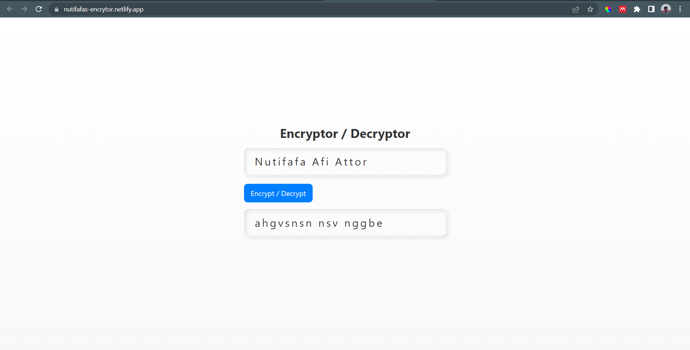

# Encryptor

This is a website that encrypts and decrypts input using Cesar Algorithm

## About This Project

I am using this website to encrypt and decrypt messages using Cesar Algorithm. This is a way for me to put my Data Structures and Algorithms knowledge in Javascript to use in my projects.

## What is Cesar Algorithm?

Cesar Algorithm is a simple encryption algorithm that shifts each letter by a certain amount. An example of this is:

```
A -> B
B -> C
C -> D
D -> E
E -> F
F -> G
G -> H
H -> I
I -> J
J -> K
K -> L
L -> M
M -> N
N -> O
O -> P
P -> Q
Q -> R
R -> S
S -> T
T -> U
U -> V
V -> W
W -> X
X -> Y
Y -> Z
Z -> A
```

In this case, the shift is 1. This means that the letter A is now B, B is now C, and so on. The algorithm used to encrypt the message is called a Caesar Cipher. The algorithm is simple and easy to understand however, it is not very secure. It is not recommended to use this algorithm for anything other than testing. Read more about it [here](https://en.wikipedia.org/wiki/Caesar_cipher).

## What I Learnt
- More understanding of how to use `indexOf` in JS
- How to sit and write my own algorithms 
- How to do some research on algorithms.
## References

-   [MAT 112 Integers and Modern Applications for the Uninitiated](https://mathstats.uncg.edu/sites/pauli/112/HTML/seccaesar.html)
-   [CSS of my previous work](https://github.com/neophyte-programmer/random-password-generator)
-   [Geeks for Geeks - Caesar Cipher in Cryptography](https://www.geeksforgeeks.org/caesar-cipher-in-cryptography/)

## Live Demo

You can see the live demo of this website [here](https://nutifafas-encrytor.netlify.app/).

## How It Looks
